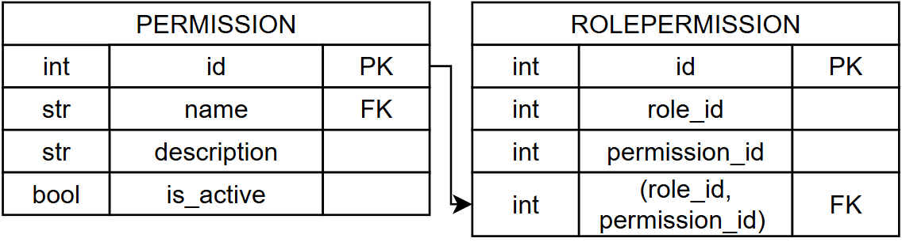

# Вариант №4
# Сервис управления разрешениями (Permission Service)

## Сущность: Permission (Разрешение)

Тонкая настройка прав: кто может редактировать расписание, кто только смотреть, кто может назначать замены.

---

### 1. Информация для создания сущности

`POST /permissions`

| Параметр | Пояснение | Обязательность | Тип | Ограничение | Значение по умолчанию |
|----------|-----------|----------------|-----|-------------|-----------------------|
| `name` | Название разрешения (например: edit_schedule, view_schedule) | Да | str | длина ≤ 100, уникально | — |
| `description` | Описание разрешения | Нет | str | длина ≤ 255 | `''` |

### 2. Информация, возвращаемая при успешном создании

| Параметр | Тип |
|----------|-----|
| `id` | int |
| `name` | str |
| `description` | str |
| `is_active` | bool |

---

## Изменить сущность по ID

### 3. Информация для изменения

`PUT /permissions/{id}`

| Параметр | Пояснение | Обязательность | Тип | Ограничение | Значение по умолчанию |
|----------|-----------|----------------|-----|-------------|-----------------------|
| `name` | Новое название | Нет | str | длина ≤ 100, уникально | текущее значение |
| `description` | Новое описание | Нет | str | длина ≤ 255 | текущее значение |
| `is_active` | Активность разрешения | Нет | bool | — | текущее значение |

### 4. Информация, возвращаемая при успешном изменении

| Параметр | Тип |
|----------|-----|
| `id` | int |
| `name` | str |
| `description` | str |
| `is_active` | bool |

---

## Удалить сущность по ID (soft delete)

`DELETE /permissions/{id}`

> Удаление реализовано как **soft delete** — запись не удаляется физически из БД, а помечается как неактивная (`is_active = false`).

| Параметр | Тип | Пояснение |
|----------|-----|-----------|
| `deleted` | bool | `true` - помечено как удалено, `false` - не найдено |

---

## Получить сущность по ID

`GET /permissions/{id}`

| Параметр | Пояснение | Тип |
|----------|-----------|-----|
| `id` | Уникальный идентификатор | int |
| `name` | Название разрешения | str |
| `description` | Описание | str |
| `is_active` | Активность разрешения | bool |

---

## Получить список сущностей по заданным параметрам

`GET /permissions`

### Параметры для получения списка

| Параметр | Тип | Описание |
|----------|-----|----------|
| `name` | str | Фильтр по названию (частичное совпадение) |
| `is_active` | bool | Фильтр по активности (true/false) |
| `limit` | int | Максимум записей (по умолчанию 100) |
| `offset` | int | Смещение для пагинации (по умолчанию 0) |

### Возвращаемый список сущностей

| Параметр | Тип |
|----------|-----|
| `id` | int |
| `name` | str |
| `description` | str |
| `is_active` | bool |

---

### Назначить разрешение роли

`POST /role-permissions`

| Параметр | Пояснение | Тип |
|----------|-----------|-----|
| `role_id` | ID роли (из Role Service) | int |
| `permission_id` | ID разрешения | int |

### Отозвать разрешение у роли

`DELETE /role-permissions`

| Параметр | Пояснение | Тип |
|----------|-----------|-----|
| `role_id` | ID роли | int |
| `permission_id` | ID разрешения | int |

---

## Точки входа REST API

| Метод | Эндпоинт | Описание |
|-------|----------|----------|
| POST | `/permissions` | Создать разрешение |
| GET | `/permissions/{id}` | Получить по ID |
| GET | `/permissions` | Получить список с фильтрацией |
| PUT | `/permissions/{id}` | Обновить |
| DELETE | `/permissions/{id}` | Удалить (soft delete) |
| POST | `/role-permissions` | Назначить разрешение роли |
| DELETE | `/role-permissions` | Отозвать разрешение |

---

## ER-диаграмма

